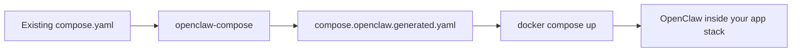

# openclaw-compose

Drop OpenClaw into an existing Docker Compose project.

`openclaw-compose` turns a regular app stack into an OpenClaw-enabled stack in a few commands. Point it at a `compose.yaml`, it generates a service that extends your app service and builds an OpenClaw-enabled image on top.



## Make your project OpenClaw-ready

1. Copy the example files:

```bash
cp .env.openclaw.example .env.openclaw
cp openclaw/openclaw.json.example openclaw/openclaw.json
```

2. Edit `.env.openclaw` and set your secrets, especially `OPENCLAW_GATEWAY_TOKEN`.
3. Edit `openclaw/openclaw.json` to suit your setup.
4. Install the package:

```bash
pip install .
```

Or, while developing:

```bash
pip install -e .
```

5. Generate an OpenClaw service for your app:

```bash
openclaw-compose -f compose.yaml -o compose.openclaw.generated.yaml
```

6. Start the combined stack:

```bash
docker compose -f compose.yaml -f compose.openclaw.generated.yaml up -d openclaw
```

Then inside the container:

```bash
openclaw doctor
openclaw onboard
```

## Why this is useful

- add OpenClaw to lots of existing Compose projects without reworking them by hand
- keep OpenClaw state separate from app state
- keep secrets in a dedicated `.env.openclaw`
- mount the checked-out project into the container at `/app`
- keep the generated file small and readable

## Common flows

### Add OpenClaw to an existing app

```bash
openclaw-compose -f compose.yaml -o compose.openclaw.generated.yaml
docker compose -f compose.yaml -f compose.openclaw.generated.yaml up -d openclaw
```

### Generate without writing a file

```bash
openclaw-compose -f compose.yaml --dry-run
```

### Mount SSH keys too

```bash
openclaw-compose -f compose.yaml --mount-ssh -o compose.openclaw.generated.yaml
```

### Help

```bash
openclaw-compose --help
```

## Visual guide

The generated service is intentionally small, it extends your app service and adds only the OpenClaw mounts you ask for.

## OpenClaw image extension

The generator now builds an OpenClaw-enabled image inline with Compose using `dockerfile_inline`, so the resulting service can install OpenClaw on top of the selected app image, whether the parent uses `image` or `build` metadata.

## Docs

- [Setup](docs/setup.md)
- [Security](docs/security.md)
- [Secrets](docs/secrets.md)
- [Recommendations](docs/recommendations.md)
- [Agents and channels](docs/agents-and-channels.md)
- Recipes:
  - [Discord](docs/recipes/discord.md)
  - [Telegram](docs/recipes/telegram.md)
  - [Tailscale / private remote access](docs/recipes/tailscale.md)
  - [Ollama / OpenAI-compatible models](docs/recipes/ollama.md)
  - [SSH profile](docs/recipes/ssh-profile.md)
  - [Overlay into an existing Compose project](docs/recipes/overlay-existing-project.md)
  - [Traefik example](docs/recipes/overlay-traefik-example.md)

## Related

- [OpenClaw Docker docs](https://docs.openclaw.ai/install/docker)
- [OpenClaw config docs](https://docs.openclaw.ai/gateway/configuration)
